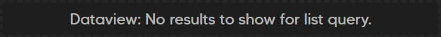
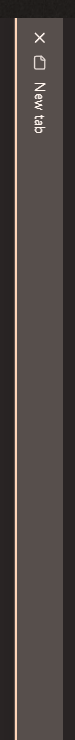

Small, modular CSS snippets to improve tiny bits of Obsidian app's appearance.

Tested compatibility with these themes:
- Encore

## What you can find here
- [Square tags](css/myster-square-tags.css)
    - 
- [Compact codeblocks in preview mode](css/myster-compact-codeblock.css)
- [Compact Dataview empty query](css/myster-compact-dataview-empty-query.css)
    - 
- [Added accents to tab names and borders](css/myster-accented-tabs.css)
-  
